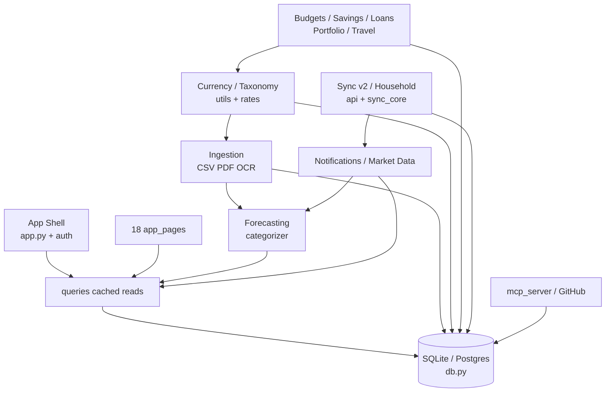

# Agent Instructions — Coordinator Entry Point

> **For future AI coding agents and subagents, not human docs.** Load this file first; it routes you to minimal context for any task. Deep details live in per-domain files — load only what the router says.

---

## Repository Snapshot

- **App:** Expense Tracker Consumer Edition v4 — single-process **Streamlit** monolith + FastAPI sidecar (`api.py:8502`) + MCP stdio server
- **Runtime:** `python:3.12-slim, streamlit 1.61.1, sqlalchemy 2.0, sqlcipher3-wheels 0.5.7 (optional), pandas 2.0`
- **Persistence:** one SQLite file `state_dir()/expense_tracker.db` (SQLCipher AES-256 by default, WAL + `busy_timeout=5000`) or Postgres via `DATABASE_URL`; 18 tables; global `data_revision` invalidates all cached reads
- **Layout:** flat root `*.py` (`db.py 2586, utils.py 731, notifications.py 652`) + `app_pages/` (18 pages, 846-line `savings.py` is the largest) + `compose.yaml/Caddyfile/Dockerfile`
- **State:** `st.session_state{user_id, display_name, settings, rates, dc, onboarding_complete}` + `@st.cache_data ttl 120-300 key=(user_id, version)` + `data/.secret_key` (master secret, never uploaded)
- **Tests:** 39 files in `tests/` (~369 tests); smoke via `tests/test_app_smoke.py`

---

## Knowledge-Domain Map

| # | Domain | Responsibility | Docs |
|---|--------|---------------|------|
| D1 | **Shell / Auth / Onboarding** | Boot, sidebar, routing, login/throttle, wizard | `app-shell/shell-and-navigation.md`, `auth-and-onboarding.md` |
| D2 | **Persistence / Crypto / Caching** | 18 tables, SQLCipher+Fernet, WAL, `bump_data_revision`, backup 30d | `persistence/data-model.md`, `encryption-and-crypto.md`, `caching-and-revision.md` |
| D3 | **Currency & Taxonomy** | 12 `CATEGORIES`, `TAXONOMY_MIGRATION`, currencies, `to_eur/fmt`, rates 3d/30m | `domain/currency-and-taxonomy.md` |
| D4 | **Ledger / Recurring / Audit** | Expense/income CRUD, soft-delete, templates, audit 200 | `domain/transactions-and-recurring.md` |
| D5 | **Planning & Wealth** | Budgets, savings+accounts, loans amortization, portfolio, big-purchases, travel | `domain/planning-and-wealth.md` |
| D6 | **Ingestion** | CSV (Revolut/N26/Wise), PDF pdfplumber, OCR Tesseract 30s, categorizer | `ingestion/import-pipeline.md`, `ocr-and-categorization.md` |
| D7 | **Intelligence** | ETS forecast 6mo, IsolationForest, insights, LLM local GGUF vs API | `intelligence/forecasting-and-anomalies.md`, `insights-and-llm.md` |
| D8 | **Connectivity** | Sync v2 (500/5000 caps), household, SMTP CERT_REQUIRED, MCP, GitHub 50MB+manifest | `connectivity/sync-and-household.md`, `notifications-and-market-data.md`, `external-surfaces.md` |
| — | **Architecture (cross-cutting)** | Layers, import graph, 7 flows, global invariants | `architecture/overview.md`, `dependency-map.md`, `execution-flows.md`, `invariants.md` |

---

## Architecture Graph



Dependency direction is **acyclic** — see `architecture/dependency-map.md` for the import fan-out and the one owned cycle (`bank_import ↔ forecasting` categorizer, owned by forecasting).

---

## Context Router — What to Load for Each Task

> **Load discipline:** `this README + 1 primary + 1-2 supporting` covers most tasks. The table tells you the minimal set — don't load the whole tree.

| Task | Load first (primary) | Also load (supporting) |
|------|----------------------|------------------------|
| Change shell, navigation, sidebar, mobile CSS, QR | `architecture/overview.md` + `app-shell/shell-and-navigation.md` | `persistence/caching-and-revision.md` |
| Change login, registration, throttling, onboarding | `app-shell/auth-and-onboarding.md` | `persistence/data-model.md`, `persistence/encryption-and-crypto.md` |
| Alter categories, currencies, rates, taxonomy migration | `domain/currency-and-taxonomy.md` | `persistence/data-model.md`, `architecture/invariants.md` |
| Fix expense/income history, pagination, edit, trash/restore | `domain/transactions-and-recurring.md` | `persistence/caching-and-revision.md`, `domain/currency-and-taxonomy.md` |
| Modify recurring checklist, drag board, due badges | `domain/transactions-and-recurring.md` | `connectivity/notifications-and-market-data.md` |
| Change budgets, fun/travel pools, salary cycle | `domain/planning-and-wealth.md` | `domain/currency-and-taxonomy.md`, `connectivity/notifications-and-market-data.md` |
| Tweak savings goals / term deposits | `domain/planning-and-wealth.md` | `persistence/data-model.md` |
| Fix loan amortization or surcharge | `domain/planning-and-wealth.md` | `persistence/data-model.md` |
| Work on portfolio / holdings / prices | `domain/planning-and-wealth.md` | `connectivity/notifications-and-market-data.md` (price refresh) |
| Repair big-purchases quadrant or wishlist→expense | `domain/planning-and-wealth.md` | `domain/transactions-and-recurring.md` |
| Fix bank CSV import or PDF statement parsing | `ingestion/import-pipeline.md` | `domain/currency-and-taxonomy.md`, `persistence/caching-and-revision.md` |
| Change OCR or category suggestion | `ingestion/ocr-and-categorization.md` | `intelligence/forecasting-and-anomalies.md`, `domain/currency-and-taxonomy.md` |
| Adjust forecast, anomalies, subscriptions | `intelligence/forecasting-and-anomalies.md` | `intelligence/insights-and-llm.md`, `domain/planning-and-wealth.md` |
| Change insights, Ask-your-data, AI narratives | `intelligence/insights-and-llm.md` | `intelligence/forecasting-and-anomalies.md` |
| Change phone sync, pairing, conflicts, household | `connectivity/sync-and-household.md` | `persistence/encryption-and-crypto.md`, `domain/currency-and-taxonomy.md` |
| Alter email alerts or bill/loan/weekly checks | `connectivity/notifications-and-market-data.md` | `domain/planning-and-wealth.md`, `domain/currency-and-taxonomy.md` |
| Add MCP tool or change GitHub backup/deploy | `connectivity/external-surfaces.md` | `persistence/data-model.md`, `persistence/encryption-and-crypto.md` |
| Risky DB / encryption / secret change | `persistence/encryption-and-crypto.md` | `persistence/data-model.md`, `connectivity/external-surfaces.md` |
| New table or new cached query | `persistence/data-model.md` + `persistence/caching-and-revision.md` | `architecture/invariants.md` |

---

## Repository-Wide Flows (5-7, linked)

| Flow | Path | Primary doc |
|------|------|-------------|
| Boot → dashboard | `app.py` shell → auth → onboarding → rates → milestones → sidebar → alerts → dashboard | `architecture/execution-flows.md#flow-1` |
| Log expense (± recurring) | form → dedup → `add_recurring?` → `add_expense` → bump → history edit/trash | `execution-flows.md#flow-2` |
| Bank CSV/PDF import | dialect/header → pdfplumber lines→text → ML→keyword categorize → review → `add_expense` | `execution-flows.md#flow-3` |
| Phone sync (v2) | pair code → Bearer → validate whitelist (500 cap) → atomic apply → snapshot ≤5000 → household | `execution-flows.md#flow-4` |
| Loan payoff | add loan → expense with `loan_id` → `loan_schedule` recompute from payments | `execution-flows.md#flow-5` |
| Budget & alerts | salary cycle → `effective_category_budgets` → dashboard bar + email STARTTLS deduped | `execution-flows.md#flow-6` |
| Price refresh | login background thread, Yahoo→StooQ, 1d staleness, last-known survives | `execution-flows.md#flow-7` |

---

## Global Invariants (must survive any change)

1. **User-scoped every DB call** — no cross-user read except explicit household aggregate.
2. **Bump on every write** — `q.bump_db_version()` after each mutation or caches lie.
3. **Dual amount** — `amount+currency` + `amount_eur` (to_eur at write, fmt at read).
4. **SQLCipher pragma on every connection** — WAL + foreign_keys ON + busy_timeout 5000.
5. **Secret never uploaded** — `data/.secret_key` excluded from GitHub manifest/backups.
6. **Taxonomy remapped three places** — `db._migrate`, `sync_core.validate_fields`, import — add categories in all three.
7. **Sync whitelist + caps** — `FIELD_SCHEMAS` rejects unknown, `MAX_CHANGES 500`, `SNAPSHOT 5000`, `since` is server-issued.
8. **Sentinel `""`** — subcategory — is stored as empty string, not em dash.
9. **Server clock only** — throttles, staleness, periods use server date, not client.
10. **XFF not trusted** — auth throttle is one shared local bucket (5/60s).
11. **Last known survives** — fetch failures keep persisted rates/prices untouched.
12. **Failure memo includes None** — 30m cache covers failures so broken network doesn't stall reruns.

Details and enforcement sites in `architecture/invariants.md`.

---

## How to Use This System

1. **Coordinator:** classify the task → look up the router row → preload listed docs into subagent context (README + 1 primary + supporting). Don't load the whole tree.
2. **Specialist:** follow the standard schema in your owned doc (Purpose → … → Common tasks router). Keep invariants code-grounded; cross-ref instead of duplicate; use `file:line` refs.
3. **After edits:** run the doc's listed tests (e.g., ledger → `tests/test_entry_editing.py`); bump version if you touched a write path; re-check invariants.
4. **Adding a new domain:** add a doc, wire it in the dependency-map edges, and add router rows here.

---

## Map of All Instruction Files

```text
agent instructions/
├── README.md                              ← you are here (router + invariants summary)
├── architecture/
│   ├── overview.md                        tech stack, layers, boot, page registry
│   ├── dependency-map.md                  import graph + doc dependency edges
│   ├── execution-flows.md                 7 cross-domain sequences (mermaid)
│   └── invariants.md                      13 global rules + dangerous coupling
├── app-shell/
│   ├── shell-and-navigation.md            boot order, sidebar, st.navigation
│   └── auth-and-onboarding.md             bcrypt/throttle, registration toggle, wizard
├── persistence/
│   ├── data-model.md                      18 tables, user scoping, soft-delete
│   ├── encryption-and-crypto.md           master secret precedence, SQLCipher, Fernet
│   └── caching-and-revision.md            data_revision, queries TTL matrix, backup 30d
├── domain/
│   ├── currency-and-taxonomy.md           CATEGORIES, migration, currencies/rates
│   ├── transactions-and-recurring.md      ledger, recurring templates, audit 200
│   └── planning-and-wealth.md             budgets/savings/loans/portfolio/travel
├── ingestion/
│   ├── import-pipeline.md                 CSV/PDF normalization → review → persist
│   └── ocr-and-categorization.md          Tesseract 30s, keyword vs ML (TF-IDF)
├── intelligence/
│   ├── forecasting-and-anomalies.md       ETS 6mo, IsolationForest 20 rows
│   └── insights-and-llm.md                insights pure funcs, LLM local vs API, Ask privacy
└── connectivity/
    ├── sync-and-household.md              v2 sync atomic, pairing 5/600s, household
    ├── notifications-and-market-data.md   SMTP CERT_REQUIRED, market Yahoo→StooQ
    └── external-surfaces.md               MCP (2 writes), GitHub 50MB+manifest, Docker/Caddy
```

Total: 19 files (~344 KB). Pass-1 discovery → 8-specialist swarm (Pass 2) → coordinator integration (this README). Re-run swarm for deep refreshes; coordinator owns the router.

---

*Designed around logical knowledge domains (high cohesion, clear interfaces), not the filesystem. Load the router row, not the repository.*
