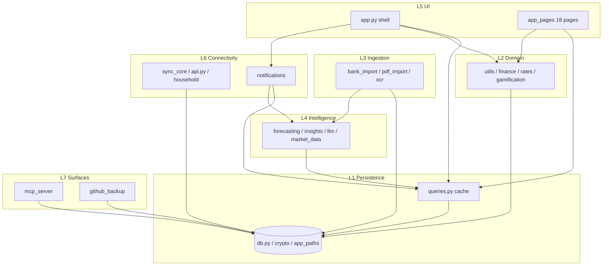

# Dependency Map — Import Graph & Knowledge-File Dependencies

> Source: grep of `import / from` across `root *.py` + `app_pages/*.py`; validates the `agent instructions/` doc graph.

---

## 1. Layer Dependency Graph



**Invariant:** graph is **acyclic** at the module level. The only import cycle risk is `bank_import ↔ forecasting` (categorizer) — resolved by owning the categorizer contract in `forecasting.py` and having `bank_import` call it as a leaf (see §4).

---

## 2. File → Knowledge-Domain Matrix

| File | Domain | Docs it belongs to |
|------|--------|-------------------|
| `app.py` | D1 Shell | `app-shell/shell-and-navigation.md` |
| `auth.py`, `onboarding.py`, `app_paths.py` | D1 | `app-shell/auth-and-onboarding.md` |
| `.streamlit/config.toml`, `Dockerfile, compose.yaml, Caddyfile` | Infra | `app-shell/shell-and-navigation.md` (runtime surface) |
| `db.py`, `queries.py`, `crypto.py` | D2 Persist | `persistence/*` (3 docs) |
| `utils.py`, `rates.py` | D3 Taxonomy/Currency | `domain/currency-and-taxonomy.md` |
| `app_pages/log_expense.py, log_income.py, recurring.py, audit_log.py` | D4 Ledger | `domain/transactions-and-recurring.md` |
| `finance.py`, `market_data.py`, `app_pages/budgets, savings, loans, portfolio, big_purchases, travel, forecast, rewards, dashboard(budget)` | D5 Planning | `domain/planning-and-wealth.md` |
| `bank_import.py, pdf_import.py, ocr.py, app_pages/bank_import_view.py, forecasting(categorizer)` | D6 Ingestion | `ingestion/import-pipeline.md` + `ocr-and-categorization.md` |
| `forecasting.py, insights.py, llm.py, app_pages/forecast, insights_view, ask, settings_ai` | D7 Intel | `intelligence/forecasting-and-anomalies.md` + `insights-and-llm.md` |
| `api.py, sync_core.py, app_pages/household, app_pages/settings(sync)` | D8 Sync | `connectivity/sync-and-household.md` |
| `notifications.py, market_data.py` | D8 Notifications | `connectivity/notifications-and-market-data.md` |
| `mcp_server.py, github_backup.py` | D8 Surfaces | `connectivity/external-surfaces.md` |

---

## 3. Import Fan-Out / Fan-In

**Most imported (central):**

| Module | Imported by | Role |
|--------|-------------|------|
| `utils` | 14+ files (every page, db, sync_core, mcp, bank_import, forecasting) | Categories, currencies, helpers — most cross-cutting |
| `db` | 12+ files (queries, auth, every write page, sync_core, api, mcp, github_backup) | Source of truth |
| `queries` (q) | 10+ files (app.py, every read page, settings) | Cached reads + bump |
| `crypto` | db, notifications, github_backup, llm, app_paths indirectly | Single master secret |

**Leaf utilities (no dependents besides pages):**

| Module | Imports | Dependents |
|--------|---------|------------|
| `finance.py` | `calendar, math` only | loans, savings, big_purchases, dashboard, insights frugally |
| `ocr.py` | stdlib + pytesseract + PIL | only `log_expense.py` (camera vs upload) |
| `pdf_import.py` | `pdfplumber, re` | only `bank_import.py` helper |

---

## 4. Circular-Dependency Watch: `bank_import ↔ forecasting`

```text
bank_import.categorize_expense  ←  forecasting clears/trains categorizer
forecasting._categorizer (TF-IDF) ← bank_import.KEYWORD_MAP fallback
```

**Resolution:** `forecasting.py` owns the model lifecycle (`train_categorizer, predict_category, clear_categorizers, CATEGORIZER_MODEL_VERSION`); `bank_import.py` is a consumer that calls `predict_category` then falls back to `KEYWORD_MAP`. Docs break the cycle by making `forecasting-and-anomalies.md` the contract owner; ingestion docs cross-ref it (see section 9 there). No `import cycle` at runtime because `bank_import` imports forecasting only inside functions that run after both modules load (verify in code if adding top-level imports).

---

## 5. External Dependencies by Domain

| Domain | PyPI packages | Services |
|--------|---------------|----------|
| Persistence | sqlalchemy, sqlcipher3-wheels (optional), cryptography, bcrypt | SQLite file or Postgres via DATABASE_URL |
| Domain | pandas, plotly, qrcode, pillow, openpyxl | — |
| Ingestion | pdfplumber, pytesseract + Tesseract binary, sklearn (categorizer) | — |
| Intelligence | scikit-learn, statsmodels, llama-cpp-python (optional) | Frankfurter, open.er-api, Yahoo, Stooq, OpenRouter/Groq |
| Connectivity | fastapi, uvicorn, requests, httpx | SMTP, GitHub Contents API |
| Surfaces | mcp | MCP host (OpenClaw) |

Every ML/LLM dep is optional — callers check import availability and return `None` + diagnostic rather than crash.

---

## 6. Knowledge-File Dependency Edges

```text
README ──needs──► architecture/overview
architecture/dependency-map ─► overview
architecture/invariants ─► overview + dependency-map

app-shell/shell-and-navigation ─► persistence/caching-and-revision + domain/currency-and-taxonomy
app-shell/auth-and-onboarding  ─► persistence/data-model + persistence/encryption-and-crypto

persistence/data-model ─► encryption-and-crypto + domain/currency-and-taxonomy (taxonomy rows)
persistence/caching-and-revision ─► data-model

domain/currency-and-taxonomy ─► persistence/caching-and-revision + architecture/invariants
domain/transactions-and-recurring ─► persistence/* + currency-and-taxonomy (+ intelligence for categorizer, optional)
domain/planning-and-wealth ─► currency-and-taxonomy + data-model + transactions-and-recurring

ingestion/import-pipeline ─► ingestion/ocr-and-categorization + currency-and-taxonomy + caching-and-revision
intelligence/forecasting-and-anomalies ─► persistence/caching + currency
intelligence/insights-and-llm ─► forecasting-and-anomalies (shared models)
connectivity/sync-and-household ─► persistence/* + currency-and-taxonomy + encryption-and-crypto
connectivity/notifications-and-market-data ─► currency + forecasting + caching + external-surfaces(crypto)
connectivity/external-surfaces ─► persistence/* + sync-and-household(Device)
```

**Load discipline validated:** every edge points from a consumer to its dependency — no cycles in the doc graph.

---

## 7. Verification Snippet

To re-derive this map from source:

```powershell
# dump every import/from line with file context
Select-String -Path *.py, app_pages/*.py -Pattern "^\s*(import|from)\s" | Sort-Object Path
# or per file
Get-Content db.py | Select-String "import"
```
