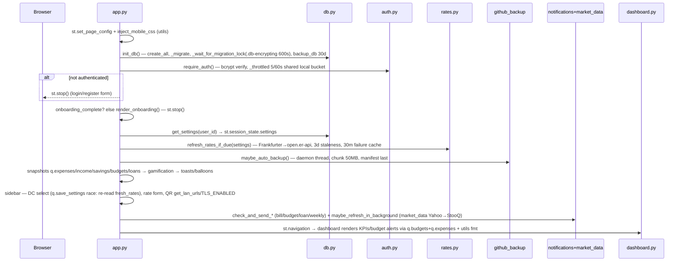
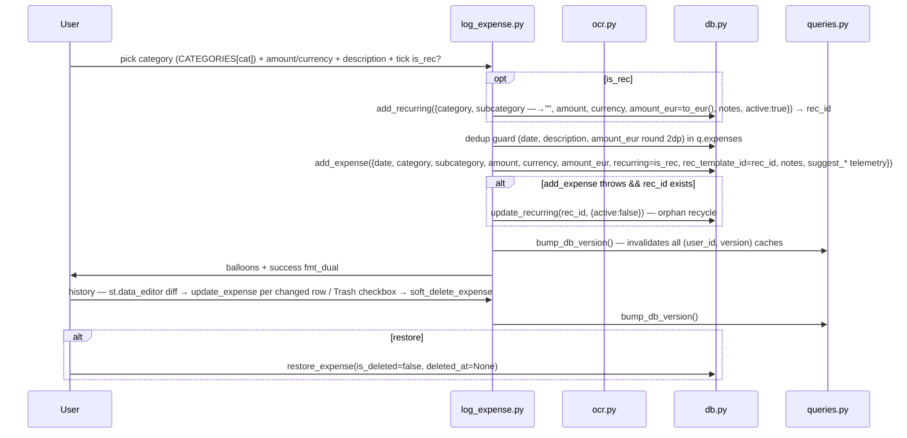
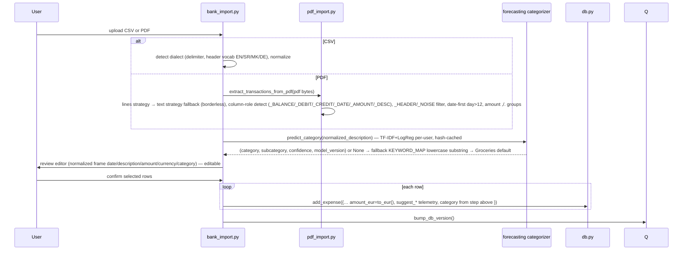

# Execution Flows — Cross-Domain Runtime Sequences

> Each flow traces an actual code path with file:line anchors. Load the primary + supporting docs listed per flow before changing that path.

---

## Flow 1 — Fresh Boot to Dashboard (shell orchestration)



**Docs:** primary `app-shell/shell-and-navigation.md` + `auth-and-onboarding.md`; supporting `persistence/caching-and-revision.md`, `domain/currency-and-taxonomy.md`, `connectivity/notifications-and-market-data.md`.

---

## Flow 2 — Log Expense (with optional recurring template)



OCR variant: `image_bytes → analyze_receipt → Tesseract (30s thread) → amount/merchant/category guess → receipt_form prefilled → Save path same as above with 8 telemetry cols.`

**Docs:** primary `domain/transactions-and-recurring.md`; supporting `persistence/data-model.md`, `persistence/caching-and-revision.md`, `domain/currency-and-taxonomy.md`, `ingestion/ocr-and-categorization.md` (OCR branch).

---

## Flow 3 — Bank Import CSV & PDF → Review → Persist



**Docs:** primary `ingestion/import-pipeline.md`; supporting `ingestion/ocr-and-categorization.md`, `domain/currency-and-taxonomy.md`, `persistence/caching-and-revision.md`.

---

## Flow 4 — Phone Sync Push/Pull (v2) + Household Aggregate

```mermaid
sequenceDiagram
  participant P as Phone PWA
  participant API as api.py :8502
  participant SC as sync_core.py
  participant DB as db.py
  P->>API: POST /pair {code, device_name} — _pair_rate_limited 5/600s per IP
  API->>DB: complete_pairing(code) → token
  P->>API: POST /api/v2/sync Bearer token {since=last_sync_at, changes:[{table, id, fields}..≤500]}
  API->>SC: _auth(Bearer) → device record → parse_since(since)
  SC->>SC: validate_fields(fields) — whitelist per FIELD_SCHEMAS, type coercion date/float/bool/str 500ch, unknown REJECT, category remap via remap_category_subcategory
  SC->>DB: atomic session — for each change: load server row, compare updated_at vs since, if server newer && values differ → add_sync_conflict (conflicts table) else apply, log_audit, touch_device_sync
  SC->>DB: bump_data_revision(user_id, include_household=true)
  API-->>P: {applied, conflicts, snapshot:{expenses, income, savings, savings_accounts ≤5000 each}}
  P->>P: store snapshot, update last_sync_at = server-issued timestamp (never client-chosen)
  Note over DB: Settings→Sync UI lists sync_conflicts for manual resolution; household_expenses aggregates all members' expenses for the shared view
```

Deprecated `POST /api/sync` (v1) remains but validates client-provided `sync_token` loosely — v2 is the secure path.

**Docs:** primary `connectivity/sync-and-household.md`; supporting `persistence/encryption-and-crypto.md`, `domain/currency-and-taxonomy.md`, `persistence/caching-and-revision.md`.

---

## Flow 5 — Loan Payment → Amortization Recompute

```mermaid
sequenceDiagram
  participant U as User
  participant LP as loans.py
  participant FI as finance.py
  participant DB as db.py
  participant LE as log_expense/history

  U->>LP: create loan (name, principal, currency, principal_eur=to_eur, annual_rate, start_date, term_months, payment_day, surcharge)
  LP->>DB: add_loan → bump
  U->>LP: "Pay" dialog — amount (+ surcharge percent/fixed via calculate_early_repayment_surcharge)
  LP->>DB: add_expense({date, category Loans & Debt, amount, loan_id=id, loan_payment_type regular|early, loan_surcharge_eur})
  LP->>DB: loan_payments = get_loan_payments(user_id, loan_id) ← expenses where loan_id
  LP->>FI: loan_schedule(principal, annual_rate, term_months, start_date, payment_day, loan_payments, asof=today)
  FI->>FI: annuity_payment principal·r(1+r)^n/((1+r)^n-1); _first_due clamping; walk k months: interest=bal·r, surcharge as interest not principal
  FI-->>LP: {monthly_payment, remaining_balance, remaining_months, payoff_date, total_interest_paid, next_payment_* , months_paid}
  LP->>U: schedule table + KPIs + next due badge
  Note over LE: Payments are ordinary expenses — editing via log_expense recomputes schedule automatically
```

**Docs:** primary `domain/planning-and-wealth.md`; supporting `persistence/data-model.md`, `domain/currency-and-taxonomy.md`.

---

## Flow 6 — Budget Progress & Alerts

```mermaid
sequenceDiagram
  participant CR as Cron/loop in app.py
  participant N as notifications.py
  participant Q as queries.py
  participant U as Utils
  participant S as SMTP

  CR->>N: check_and_send_budget_alerts(user_id, q.expenses, q.budgets, settings, rates, DC)
  N->>Q: budgets rows Unique(user, year, month, cat, subcat) + expenses in salary cycle (compute_salary_cycle salary_day=10)
  N->>U: effective_category_budgets + fun_spent/travel_spent + fmt
  alt spent >= 100% or >= NEAR_LIMIT_THRESHOLD 80%
    N->>S: send_email_async(STARTTLS CERT_REQUIRED, daemon thread) — CR/LF stripped subject, HTML escaped body
    S-->>N: on_done(true)→ atomic_update_setting_json sent_markers per-month dedupe; on failure no marker
  end
  CR->>N: check_and_send_bill_reminders — _unlogged_templates(active filtered by filter_started_templates + due_day badge) vs today
  CR->>N: check_loan_reminders — loan_schedule next due vs today
  CR->>N: check_and_send_weekly_summary — weekly_summary_last_sent guard
```

Dashboard renders the same budget progress as a live bar (no email) via the same helpers.

**Docs:** primary `connectivity/notifications-and-market-data.md` + `domain/planning-and-wealth.md`; supporting `domain/currency-and-taxonomy.md`, `persistence/caching-and-revision.md`.

---

## Flow 7 — Portfolio Price Refresh (background)

```mermaid
sequenceDiagram
  participant AP as app.py login
  participant MD as market_data.py
  participant DB as db.py
  AP->>MD: maybe_refresh_in_background(user_id) — thread + _refresh_lock
  MD->>DB: get_holdings(user_id) — each {symbol, quantity, last_price, last_price_date}
  loop each holding where last_price_date older than PRICES_MAX_AGE_DAYS=1 (or never)
    MD->>MD: fetch_price_yahoo(symbol) → float or None
    alt Yahoo null
      MD->>MD: fetch_price_stooq CSV fallback
    end
    MD->>DB: update_holding + add_holding_price(history) ; bump_data_revision
  end
  alt network fails
    MD-->>DB: last known persisted — no overwrite with null; _fetch_cached 30m failure memo
  end
```

**Docs:** primary `connectivity/notifications-and-market-data.md` + `domain/planning-and-wealth.md`; supporting `persistence/data-model.md`.
